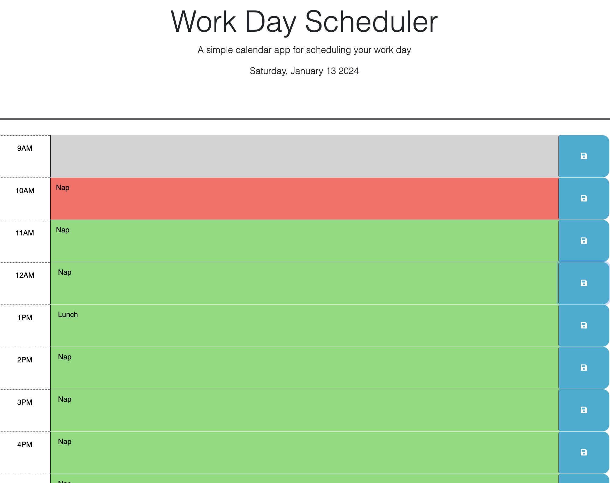
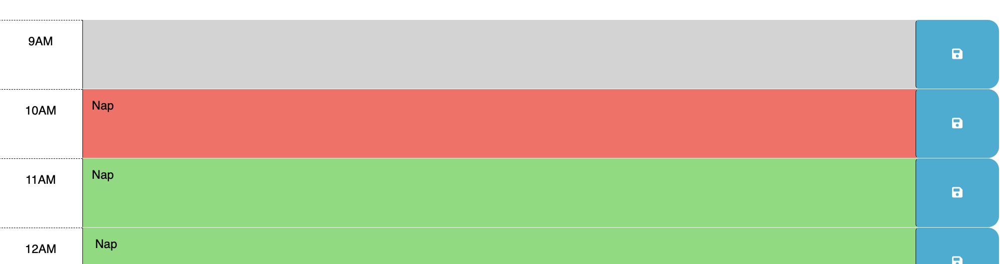

# Work Day Scheduler Starter Code

## Description
The following project has been completed as a part of the Adelaide University Web Development Bootcamp. The aim of this assignment was to practice and demonstrate my understanding of third party APIs such as jquery, bootstrap and dayjs. The project provides a simple day planner that has the ability to save the inputted data so that it will still be presented to you if you leave the page and return later.

This project was a great introduction to using jquery and dayjs. It improved my understanding of jquery DOM traversal and click events. It was also useful to play around with the dayjs to format dates.

Live Link: https://klanger98.github.io/Work-Day-Scheduler/

## Usage
To load this website follow the live link listed above. 

Once the page is loaded you will be presented with the current date at the top of the page and a daily planner segmented by hours in your regular 9-5 job. 

When interacting with the hour segments you will be able to add information to the textarea and press save. This way the data will remain in that hour block when you leave and return to the website. 

The page will also keep track of the current time and show which hour it currently is with the color red as the background in that hour, the color grey if that hour has passed and the color green for hours in the future. 

